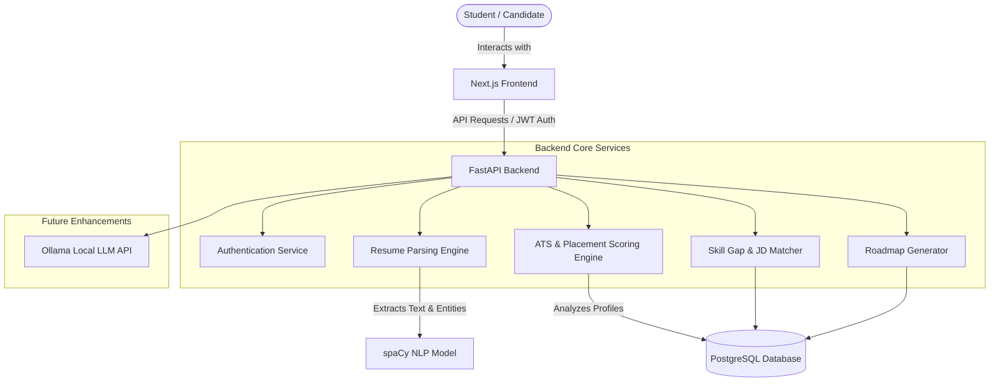
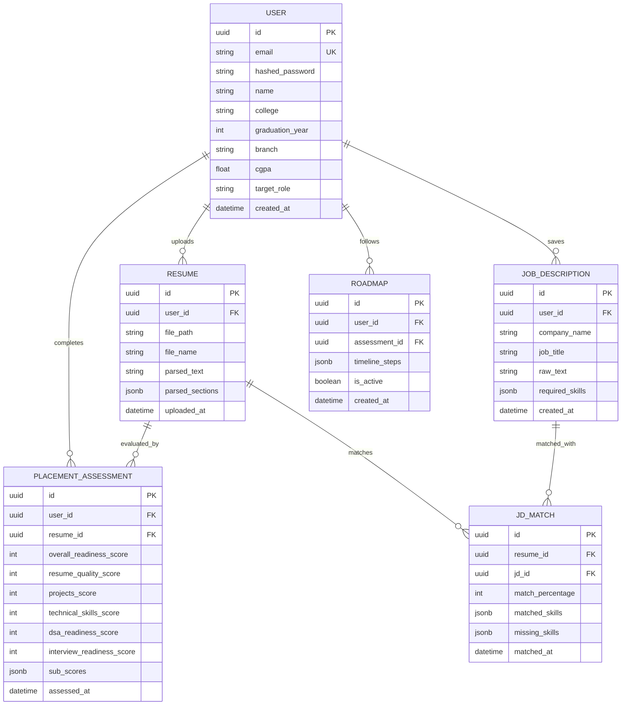
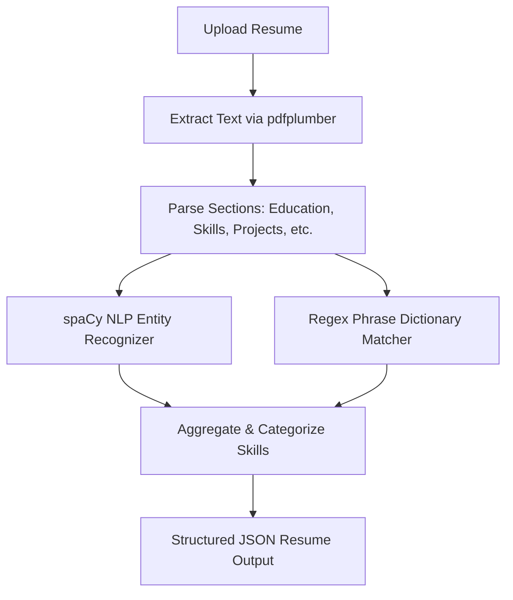

# NextRound Architecture Design Document

This document outlines the architectural specifications, system designs, and data flow pipelines for **NextRound**, an AI-powered placement readiness platform for engineering candidates.

---

## 1. System Overview

NextRound uses a decoupled monorepo architecture with a React-based Next.js frontend, a Python-based FastAPI backend, and a PostgreSQL database. The backend uses NLP (via spaCy) for parsing and matching, and incorporates local LLMs (via Ollama/Qwen) for complex feedback and mock interviews in future phases.

### High-Level System Architecture



---

## 2. Directory Structure

The monorepo structure is organized as follows:

```
NextRound/
├── .github/
│   └── workflows/          # CI/CD pipelines (Linters, Tests, Docker builds)
├── backend/                # FastAPI application
│   ├── app/
│   │   ├── api/            # API endpoints (v1)
│   │   ├── core/           # Config, security, DB connections
│   │   ├── engines/        # Parsing, ATS, scoring, roadmap, NLP engines
│   │   ├── models/         # SQLAlchemy DB models
│   │   ├── schemas/        # Pydantic validation schemas
│   │   └── services/       # Business logic (users, resume uploads)
│   ├── tests/              # Pytest suite
│   ├── Dockerfile
│   ├── requirements.txt
│   └── main.py
├── frontend/               # Next.js 14+ typescript frontend
│   ├── src/
│   │   ├── app/            # App Router pages and layouts
│   │   ├── components/     # UI components (shadcn/ui based)
│   │   ├── hooks/          # Custom React hooks
│   │   ├── lib/            # Utilities (API client, helpers)
│   │   └── types/          # TypeScript definitions
│   ├── public/
│   ├── Dockerfile
│   ├── package.json
│   └── tailwind.config.js
├── docs/                   # API specs, manuals, and templates
├── docker/                 # Production-specific Docker configurations
├── scripts/                # Database migrations, seed scripts, utility scripts
├── docker-compose.yml      # Local multi-container development environment
├── README.md
├── LICENSE
└── architecture.md         # This document
```

---

## 3. Database Schema Design (ERD)

The relational database model captures user details, parsed resume histories, job descriptions, evaluation scores, and personalized roadmap plans.



---

## 4. Key Engines and Algorithms

### 4.1 Resume Upload & Parsing Engine
1. **Document Ingestion**: Backend ingests `.pdf` and `.docx` files.
2. **Text Extraction**: Uses `pdfplumber` for precise character coordinate extractions and tabular data capture (important for education history extraction). Falls back to `PyPDF2` or `python-docx` depending on the extension.
3. **NLP Section Classification**: Rules combined with spaCy NLP identify section boundaries (e.g., separating "Projects" from "Experience").
4. **Skill & Tech Stack Harvesting**: Runs text through custom spaCy NER models and regular expression mapping layers to categorize languages, frameworks, databases, and DevOps tools.



### 4.2 ATS Scoring Engine
Generates a score out of 100 based on standard industry filters:
* **Formatting (20%)**: Checks for single-page layout compatibility, clear standard headings, and absence of complex non-parseable structures (e.g., complex multi-column tables, vector graphics, image-based pages).
* **Content Completeness (20%)**: Verifies presence of contact details, education history, projects, and skills.
* **Skill Density (20%)**: Evaluates quantity and variety of technology classifications (Languages, Backend, Frontend, DBs).
* **Keywords (20%)**: Evaluates alignment with core software engineering keywords (e.g., git, API, database, testing, optimization).
* **Action Verb / Impact Analysis (20%)**: Uses NLP to analyze project descriptions for action-oriented verbs (e.g., "Led", "Optimized", "Architected") and quantified metrics (e.g., percentage improvements, response time drops).

### 4.3 Placement Readiness Score (Core Metric)
The flagship feature evaluates the candidate's absolute preparedness for entry-level roles:

$$\text{Readiness Score} = \text{Resume (20\%)} + \text{Projects (20\%)} + \text{Technical Skills (20\%)} + \text{DSA (20\%)} + \text{Interview (20\%)} $$

* **Resume (20 pts)**: Evaluated directly from the ATS score.
* **Projects (20 pts)**: Scored on tech stack completeness, deployment links presence (GitHub, Vercel/Render), and complexity index.
* **Technical Skills (20 pts)**: Evaluated relative to the selected **target role** requirements (e.g., backend, fullstack).
* **DSA Readiness (20 pts)**: Evaluated from self-reported or linked LeetCode totals, platform metrics, and coverage of major structures (Trees, Graphs, DP).
* **Interview Readiness (20 pts)**: Evaluated based on progress logs from mock questions or behavioral self-assessments.

### 4.4 Job Description Matching & Skill Gap Analysis
Matches candidate's parsed profiles against specific JD texts:
1. **Extraction**: Extracts requirements from the uploaded Job Description.
2. **Intersection Matrix**: Compares profile skills against job requirements.
3. **Similarity Vectors**: Uses spaCy's semantic similarity vectors to identify synonyms (e.g., mapping "MySQL" in a resume to "Relational Databases" in a JD).
4. **Output**: Computes a percentage score, generates list of **matched skills** and **missing skills** that must be acquired.

---

## 5. Implementation Roadmap

```
Phase 1: Foundations (Late July)
├── User Auth (JWT) & Profile setup
├── PDF/DOCX Parsing API (pdfplumber)
├── Basic Regex-based Skill Extraction
└── Formatting/Completeness ATS Score Engine

Phase 2: NLP & Matching (Early August)
├── Integration of spaCy Pipeline
├── Job Description matching endpoint
├── Similarity vectors for skill synonym alignment
└── Detailed Skill Gap output reports

Phase 3: Readiness & Roadmaps (Mid August)
├── Five-pillar Placement Readiness Scoring Engine
├── Dynamic weighted evaluation by Target Role
├── Timeline-based Roadmap Generator
└── History logging & readiness progress tracking dashboard
```
