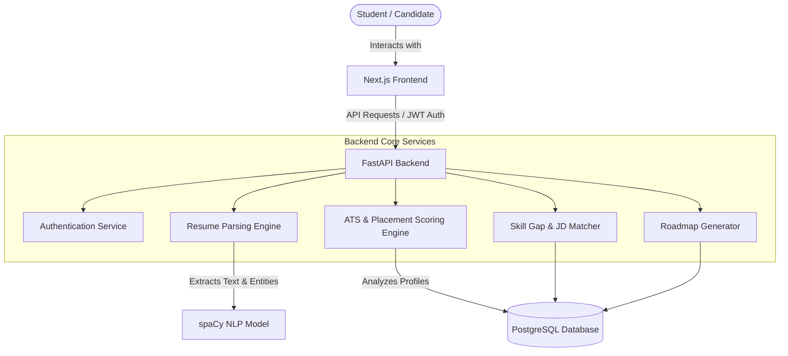

# System Architecture

This document describes the architectural specifications, component boundaries, and pipelines for the NextRound monorepo.

---

## 1. System Overview

NextRound uses a decoupled monorepo structure with a React-based Next.js frontend, a Python-based FastAPI backend, and a PostgreSQL database.

---

## 2. Core Processing Engines

### 2.1 Resume Parsing Engine
1. **Document Ingestion**: FastAPI uploads PDF or DOCX templates.
2. **Text Extraction**: Uses `pdfplumber` for precise character coordinate extractions and tabular data capture (important for education history extraction).
3. **NLP Section Classification**: Rules combined with spaCy NLP identify section boundaries (e.g., separating "Projects" from "Experience").
4. **Skill & Tech Stack Harvesting**: Runs text through custom spaCy NER models and regular expression mapping layers to categorize languages, frameworks, databases, and DevOps tools.

### 2.2 ATS Scoring Engine
Generates a score out of 100 based on standard industry filters:
* **Formatting (20%)**: Checks for single-page layout compatibility, clear standard headings, and absence of complex non-parseable structures.
* **Content Completeness (20%)**: Verifies presence of contact details, education history, projects, and skills.
* **Skill Density (20%)**: Evaluates quantity and variety of technology classifications (Languages, Backend, Frontend, DBs).
* **Keywords (20%)**: Evaluates alignment with core software engineering keywords (e.g., git, API, database, testing, optimization).
* **Action Verb / Impact Analysis (20%)**: Uses NLP to analyze project descriptions for action-oriented verbs and quantified metrics.

### 2.3 Placement Readiness Score (Core Metric)
The flagship feature evaluates the candidate's absolute preparedness for entry-level roles:

$$\text{Readiness Score} = \text{Resume (20\%)} + \text{Projects (20\%)} + \text{Technical Skills (20\%)} + \text{DSA (20\%)} + \text{Interview (20\%)} $$

* **Resume (20 pts)**: Evaluated directly from the ATS score.
* **Projects (20 pts)**: Scored on tech stack completeness, deployment links presence (GitHub, Vercel/Render), and complexity index.
* **Technical Skills (20 pts)**: Evaluated relative to the selected **target role** requirements.
* **DSA Readiness (20 pts)**: Evaluated from self-reported or linked LeetCode totals, platform metrics, and coverage of major structures (Trees, Graphs, DP).
* **Interview Readiness (20 pts)**: Evaluated based on progress logs from mock questions or behavioral self-assessments.

### 2.4 Job Description Matching & Skill Gap Analysis
Matches candidate's parsed profiles against specific JD texts:
1. **Extraction**: Extracts requirements from the uploaded Job Description.
2. **Intersection Matrix**: Compares profile skills against job requirements.
3. **Similarity Vectors**: Uses spaCy's semantic similarity vectors to identify synonyms (e.g., mapping "MySQL" in a resume to "Relational Databases" in a JD).
4. **Output**: Computes a percentage score, generates list of **matched skills** and **missing skills** that must be acquired.
