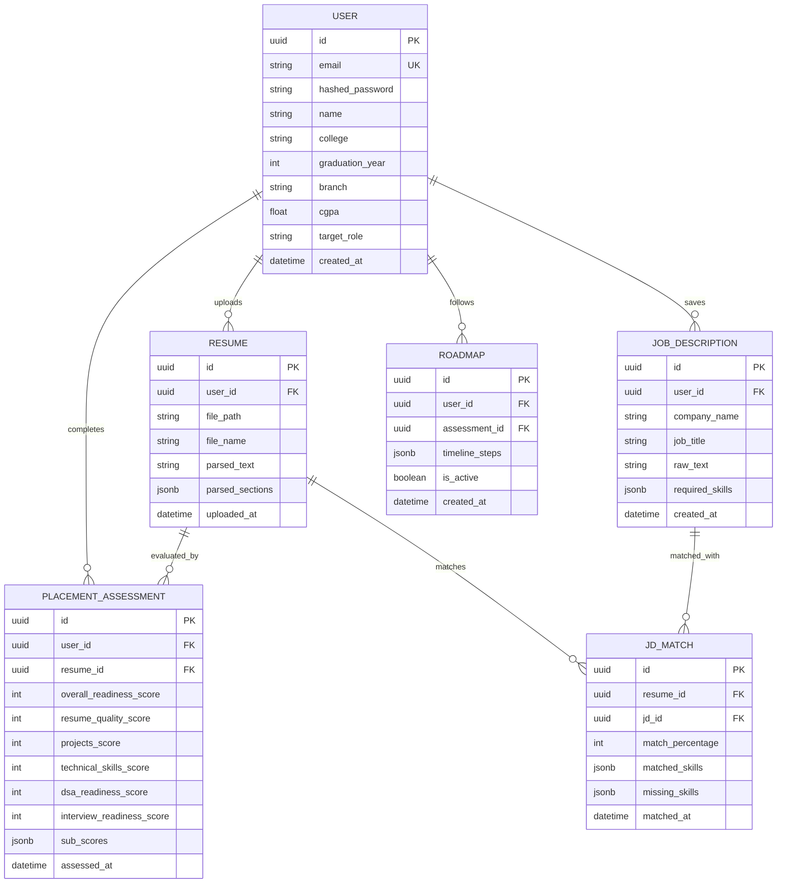

# Database Schema & Design

NextRound uses PostgreSQL 17 to persist user profiles, resume text, assessment results, and study roadmaps. The database connection is handled using SQLAlchemy 2.0.

---

## 1. Entity Relationship Diagram (ERD)



---

## 2. Table Specifications

### 2.1 Users Table (`users`)
Stores core user account credentials and identity information.
* **Indexes**: `email` (Unique, B-Tree), `username` (Unique, B-Tree).

| Column Name | Type | Constraints | Description |
| :--- | :--- | :--- | :--- |
| `id` | `UUID` | Primary Key, default `uuid_generate_v4()` | Unique user identifier |
| `email` | `VARCHAR(255)` | Unique, Indexed, Not Null | Candidate login email |
| `username` | `VARCHAR(255)` | Unique, Indexed, Nullable | Candidate unique handle |
| `hashed_password`| `VARCHAR(255)` | Not Null | Hashed password (Bcrypt) |
| `name` | `VARCHAR(255)` | Not Null | Display name (maps to `full_name`) |
| `role` | `VARCHAR(50)` | Not Null, default `'user'` | Role assignment |
| `is_active` | `BOOLEAN` | Not Null, default `true` | Account active flag |
| `created_at` | `TIMESTAMP` | Not Null, Default UTC now | Row creation timestamp |
| `updated_at` | `TIMESTAMP` | Not Null, Default UTC now | Row modification timestamp |


### 2.2 Resumes Table (`resumes`)
Persists parsed resume contents.
* **JSONB Fields**: `parsed_sections` maps headers to text chunks (e.g., `{"Education": "...", "Skills": "..."}`).

| Column Name | Type | Constraints | Description |
| :--- | :--- | :--- | :--- |
| `id` | `UUID` | Primary Key | Resume record ID |
| `user_id` | `UUID` | Foreign Key (`users.id`), cascade delete | Reference to the owner candidate |
| `file_path` | `VARCHAR(512)` | Not Null | Path to local or S3 PDF file |
| `file_name` | `VARCHAR(255)` | Not Null | Original upload file name |
| `parsed_text` | `TEXT` | Not Null | Raw text extracted from document |
| `parsed_sections`| `JSONB` | Default `{}` | Extracted sections mapping |
| `uploaded_at` | `TIMESTAMP` | Default UTC now | Upload timestamp |

### 2.3 Placement Assessments Table (`placement_assessments`)
Maintains evaluations along the five pillars.
* **JSONB Fields**: `sub_scores` preserves details on metrics (e.g., actions verb count, skill coverage levels).

| Column Name | Type | Constraints | Description |
| :--- | :--- | :--- | :--- |
| `id` | `UUID` | Primary Key | Assessment ID |
| `user_id` | `UUID` | Foreign Key (`users.id`) | Reference to user |
| `resume_id` | `UUID` | Foreign Key (`resumes.id`) | Reference to the evaluated resume |
| `overall_readiness_score` | `INTEGER` | Check range (0-100) | Compiled overall score |
| `resume_quality_score` | `INTEGER` | Check range (0-20) | Resume pillar score |
| `projects_score` | `INTEGER` | Check range (0-20) | Projects complexity score |
| `technical_skills_score` | `INTEGER` | Check range (0-20) | Tech stack relevance score |
| `dsa_readiness_score` | `INTEGER` | Check range (0-20) | LeetCode/Algorithmic score |
| `interview_readiness_score`| `INTEGER` | Check range (0-20) | Mock interview score |
| `sub_scores` | `JSONB` | Default `{}` | Metric metadata breakdown |
| `assessed_at` | `TIMESTAMP` | Default UTC now | Assessment creation timestamp |

### 2.4 Job Descriptions Table (`job_descriptions`)
Persists JDs copy-pasted or uploaded by users.

| Column Name | Type | Constraints | Description |
| :--- | :--- | :--- | :--- |
| `id` | `UUID` | Primary Key | Job description ID |
| `user_id` | `UUID` | Foreign Key (`users.id`) | Reference to creator user |
| `company_name` | `VARCHAR(255)` | Nullable | Target company name |
| `job_title` | `VARCHAR(255)` | Nullable | Job title description |
| `raw_text` | `TEXT` | Not Null | Raw text of JD |
| `required_skills`| `JSONB` | Default `[]` | Extracted required skills |
| `created_at` | `TIMESTAMP` | Default UTC now | Record timestamp |

### 2.5 JD Matches Table (`jd_matches`)
Stores results of a comparison between a resume and a job description.

| Column Name | Type | Constraints | Description |
| :--- | :--- | :--- | :--- |
| `id` | `UUID` | Primary Key | Match ID |
| `resume_id` | `UUID` | Foreign Key (`resumes.id`) | Reference to candidate resume |
| `jd_id` | `UUID` | Foreign Key (`job_descriptions.id`) | Reference to target JD |
| `match_percentage`| `INTEGER` | Check range (0-100) | Calculated similarity metric |
| `matched_skills` | `JSONB` | Default `[]` | Matched capabilities list |
| `missing_skills` | `JSONB` | Default `[]` | Extracted skill gaps |
| `matched_at` | `TIMESTAMP` | Default UTC now | Match calculation timestamp |

### 2.6 Roadmaps Table (`roadmaps`)
Stores weekly timeline learning schedules.
* **JSONB Fields**: `timeline_steps` stores structural roadmaps (e.g., `[{"week": 1, "topic": "Docker", "resources": []}]`).

| Column Name | Type | Constraints | Description |
| :--- | :--- | :--- | :--- |
| `id` | `UUID` | Primary Key | Roadmap ID |
| `user_id` | `UUID` | Foreign Key (`users.id`) | Reference to target candidate |
| `assessment_id` | `UUID` | Foreign Key (`placement_assessments.id`)| Associated assessment context |
| `timeline_steps` | `JSONB` | Default `[]` | Step-by-step weekly list |
| `is_active` | `BOOLEAN` | Default `true` | Tells if this is the active plan |
| `created_at` | `TIMESTAMP` | Default UTC now | Plan creation timestamp |

---

## 3. Migration Policy (Alembic)
* **Never** run `Base.metadata.create_all()` in production code. 
* All database changes must be executed using Alembic migration scripts.
* Revisions must be auto-generated:
  ```bash
  docker compose exec backend alembic revision --autogenerate -m "description"
  ```
* Generated revisions must be committed to the code repository under `backend/migrations/versions`.
